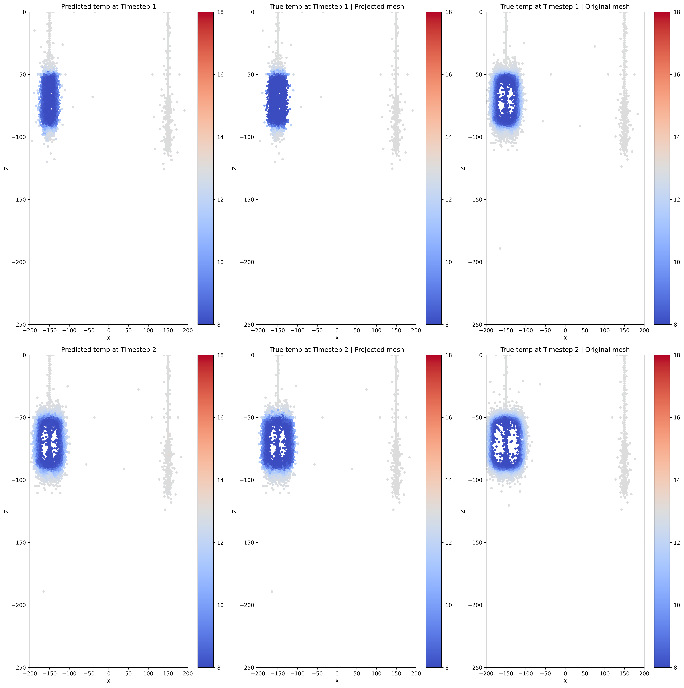

# Independent Research Project (MSc thesis)
## Rapid modelling of ATES using Machine Learning

This repository demonstrates the deployment and visualization of the ML-based models that delivers accurate prediction on subsurface temperature and pressure by auto-regressive Graph Neural Network. It contains model architecture and pre-trained models that can perform prediction on data generated from IC-FERST (link : [more details on IC-FERST](https://www.imperial.ac.uk/earth-science/research/research-groups/norms/software/ic-ferst/)).

## Installation Guide

1. Download the package from the IRP repository on github
2. Navigate into the directory which contains `environment.yml` and create the environment. Run the following command in terminal.
```bash
conda env create -f environment.yml
```
3. Activate the environment created. 

4. You can install it as an independent `python` package by running the command
```bash
pip install .
```
---
## Data structure (in Memory Dataset)
- The data are generated from IC-FERST that is contained in the following struture:
```
.
data/
├── processed/
│   └── data.pt                    # Processed data file for training/testing
├── raw/
│   ├── scenarios/                 # Directory containing all scenario subdirectories
│   │   ├── {scenario_id}/         # Each scenario's raw data is stored in its own directory
│   │   ├── scenario1/             # Example scenario directory
│   │   ├── scenario2/             # Another scenario directory
│   │   └── ...                    # Additional scenarios
│   └── scenariodatabase_ATES.csv  # CSV file containing metadata for all scenarios
```
---
## Descriptions of utility functions and classes
1. **Dataset creation and pre-processing**: To prepare the dataset for re-training model, you can use the *TemporalGraphDataset* to instantiate the dataset for training with the data structure above.

2. **Dataset for vizualization**: To visualize the temporal evolution of a specific scenario, you can create a single scenario dataset by instantiating the class *SingleScenarioDataset*.

```python
input_dim = 5  # [Temperature, Pressure, Kz, injection, next_injection] = 5 features
hidden_dim = 128
output_dim = 2  # Assuming we are predicting both temperature and pressure

model = UNetGCN(input_dim, hidden_dim, output_dim)
device = torch.device('cuda' if torch.cuda.is_available() else 'cpu')

state_dict = torch.load('best_model/best_model_GCNConv_back.pth', map_location=device)
model.load_state_dict(state_dict)
```


3. **Generate predictions with pre-trained models**: To generate predictions and visualize the prediction of certain pre-trained model, you can instantiate and load the pre-trained weight from the best_model folder.  You can choose either backward or forward projection in generating predictions. There are 2 plot cross section functions to create an instant view of predictions with selected timesteps for each projection scheme respectively. 

```python
graphs = [viz_dataset[i] for i in range(0, 3)]
mean = viz_dataset.mean_temp.numpy()
std = viz_dataset.std_temp.numpy()

back_plot_cross_section(graphs, model, mean, std, device, y_value=0, epsilon=10, dims=200, mode = 'temp')
```


---
## Pre-trained model availabilities
1. U-GCN
2. U-GAT/GCN (hybrid layers)
3. Multihop GCNConv (K = 2 hops)
4. Multihop GCNConv (K = 3 hops)
